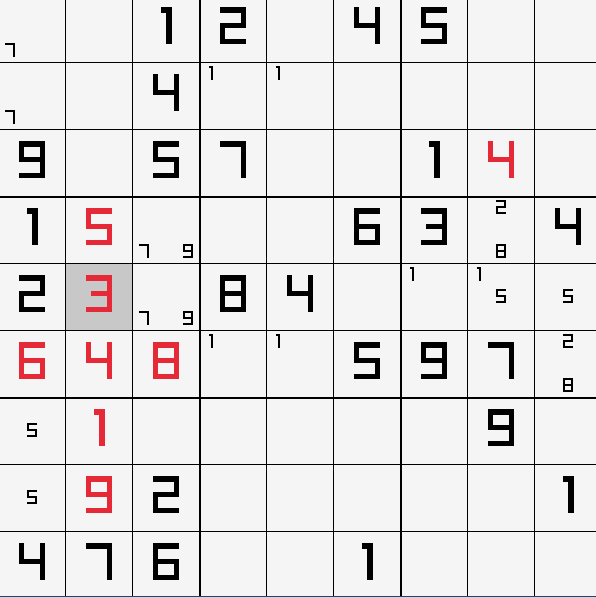

# Sudoku
Aplikacija za reševanje in generiranje sudoku mrež, napisana v C z grafično knjižnico Raylib

## Princip reševanja
Program rešuje mreže z uporabo backtracking algoritma ter logičnih optimizacij, ki jih lahko naredimo pred izvajanjem algoritma.

## Gradnja
Za grajenje uporabite CMake in se nanašajte na datoteko CMakeLists.txt v glavnem direktoriju. Ustvarite nov direktorij za shranjevanje vseh gradbenih datotek, se pomaknite vanj in izvedite ukaz za CMake:

    mkdir build
    cd build
    cmake -G<generator> ..

Potem dokončno zgradite projekt z generatorjem, ki ste ga vpisali pod cmake ukazom (make, ninja ...)

Program se bo po gradnji nahajal v tem direktoriju, ki ste ga zgradili, pod imenom "sudoku"

## Uporaba programa

### Zagon programa
Program preprosto zaženete s klikom na program oz. zagonom iz terminala.

### Spreminjanje mreže
Če želite, lahko vstavite zaželjeno mrežo v datoteko "sudoku.txt". Mreža mora biti napisana v eni vrstici. Za zgled si lahko ogledate že ustvarjeno sudoku.txt datoteko.

### Konfiguracija programa
Konfiguracijo okna in programa lahko spreminjate v "config.txt", kjer prva številka določa dolžino in širino okna, druga pa število praznih polj v novogenerirani sudoku mreži

### Kontrole znotraj programa
|Ukaz|Kontrola|
|:--|:-:|
|Premikanje|Pušcice ali I/J/K/L|
|Vstavljanje številk/notacij|Številke 1-9|
|Brisanje številk/notacij|0|
|Spreminjanje načina vnosa|A - alter|
|Reševanje mreže|S - solve|
|Brisanje uporabnikovih vnosov|C - clear|
|Generiranje nove mreže|R - reset|

## Izgled programa

